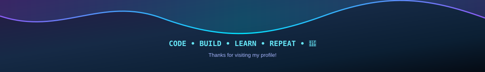

<!-- ========================================================= -->
<!--                       ANIMATED HEADER                     -->
<!-- ========================================================= -->

  

  

---

<table>
<tr>
<td width="60%" valign="top">

I am a passionate **PHP Laravel Developer** with **2.5+ years of experience** building scalable web applications, REST APIs, and database-driven systems. I focus on clean, maintainable code and reliable backend solutions.

- 🔭 Building scalable **Laravel applications & REST APIs**.
- 🧠 Interested in **backend architecture, API security & optimization**.
- ⚡ Passionate about **learning new technologies and AI automation**.

</td>

<td width="40%" align="center">

</td>
</tr>
</table>

---

## 🛠️ Tech Stack

---

## 📊 GitHub Analytics

---

## 📊 Performance Analytics

---

### 💻 Code. Build. Learn. Repeat. 🚀

<!-- ========================================================= -->
<!--                       ANIMATED FOOTER                     -->
<!-- ========================================================= -->

  

